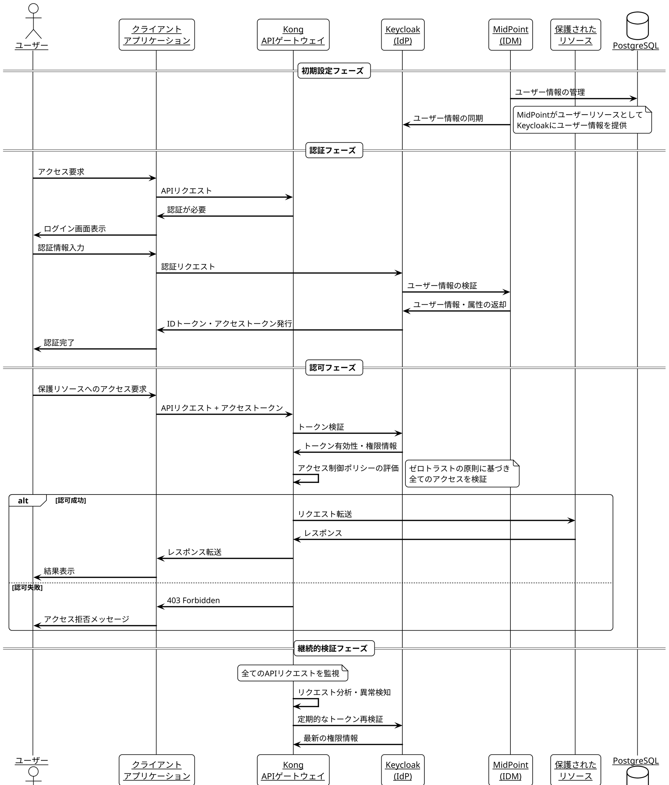

# IDP-Sample - 社内認証認可基盤サンプル

このリポジトリは社内の認証認可基盤をOSSベースで構築するためのアーキテクチャサンプルです。Keycloak、MidPoint、Kongを統合して、ゼロトラストアーキテクチャを実現します。

## アーキテクチャ概要

このプロジェクトは以下のOSSコンポーネントを統合しています：

- **Keycloak (8080ポート)**: 認証・認可基盤
- **MidPoint (8081ポート)**: IDM（Identity Management）
- **Kong (8000/8001ポート)**: APIゲートウェイ
- **PostgreSQL (5432ポート)**: 共有データベース


## 認証・認可フロー

このシステムでは、以下のような認証・認可フローを実現しています：

1. **ユーザー管理**: MidPointがIDMとして機能し、ユーザー情報をKeycloakと同期します
2. **認証プロセス**: KeycloakがIdP（Identity Provider）として機能し、OIDCプロトコルを使用して認証を行います
3. **認可制御**: Kongが全てのAPIリクエストを監視し、ゼロトラストの原則に基づいて認可を行います

以下のシーケンス図は、システム全体の認証・認可フローを示しています：



### 詳細な認証・認可フロー

#### 初期設定フェーズ
1. MidPointがユーザー情報を管理し、PostgreSQLデータベースに保存します
2. MidPointはKeycloakとユーザー情報を同期し、ユーザーリソースとして機能します

#### 認証フェーズ
1. ユーザーがクライアントアプリケーションにアクセスします
2. クライアントアプリケーションはKong APIゲートウェイにリクエストを送信します
3. Kongは認証が必要であることを判断し、クライアントに通知します
4. クライアントはユーザーにログイン画面を表示します
5. ユーザーが認証情報を入力します
6. クライアントはKeycloakに認証リクエストを送信します
7. KeycloakはMidPointと連携してユーザー情報を検証します
8. MidPointはユーザー情報と属性をKeycloakに返却します
9. KeycloakはIDトークンとアクセストークンを発行します
10. クライアントはユーザーに認証完了を通知します

#### 認可フェーズ
1. 認証済みユーザーが保護されたリソースへのアクセスを要求します
2. クライアントはアクセストークンを含めてKongにAPIリクエストを送信します
3. KongはKeycloakにトークンの検証を依頼します
4. Keycloakはトークンの有効性と権限情報をKongに返却します
5. Kongはアクセス制御ポリシーを評価します（ゼロトラストの原則に基づく）
6. 認可が成功した場合、Kongはリクエストを保護されたリソースに転送し、結果をユーザーに返します
7. 認可が失敗した場合、Kongは403 Forbiddenエラーを返します

#### 継続的検証フェーズ
1. Kongは全てのAPIリクエストを監視し、異常を検知します
2. Kongは定期的にKeycloakにトークンの再検証を依頼します
3. Keycloakは最新の権限情報をKongに提供します

このアーキテクチャにより、ゼロトラストセキュリティモデルを実現し、全てのアクセスが適切に認証・認可されることを保証します。

## 前提条件

- Docker と Docker Compose がインストールされていること
- 最低8GBのRAM
- 10GBの空きディスク容量

## クイックスタート

### 1. リポジトリのクローン

```bash
git clone https://github.com/shirok420/idp-sample.git
cd idp-sample
```

### 2. 環境の起動

```bash
docker-compose up -d
```

初回起動時は、各コンテナのイメージのダウンロードとデータベースの初期化に数分かかることがあります。

### 3. 各サービスへのアクセス

- **Keycloak 管理コンソール**: http://localhost:8080/admin
  - ユーザー名: `admin`
  - パスワード: `admin`

- **MidPoint 管理コンソール**: http://localhost:8081
  - ユーザー名: `administrator`
  - パスワード: `5ecr3t`

- **Kong 管理API**: http://localhost:8001
- **Kong プロキシ**: http://localhost:8000

## 詳細設定

### Keycloak

Keycloakには初期設定として「idp」レルムが設定されています。このレルムには以下のユーザーが含まれています：

- 管理者ユーザー:
  - ユーザー名: `admin`
  - パスワード: `admin`
  - ロール: `admin`, `user`, `api-access`

- 一般ユーザー:
  - ユーザー名: `user`
  - パスワード: `user`
  - ロール: `user`

### MidPoint

MidPointには基本的なシステム設定が含まれています。初期設定後、以下の手順でIDMの設定を行うことができます：

1. MidPoint管理コンソールにログイン
2. リソースコネクタの設定
3. ロールの定義
4. ユーザープロビジョニングポリシーの設定

### Kong

Kongは以下のサービスへのルーティングが設定されています：

- `/auth` → Keycloak
- `/midpoint` → MidPoint

APIゲートウェイの詳細設定は `config/kong/kong.yml` ファイルで行うことができます。

## 開発環境

このプロジェクトは開発環境として Docker Compose を使用しています。本番環境では Kubernetes を使用することを推奨します。

## GitOpsによる設定管理

このプロジェクトでは、TerraformとGitHub Actionsを使用してKeycloakのOAuthClient設定をGitOpsによって管理しています。詳細は [terraform-gitops.md](docs/terraform-gitops.md) を参照してください。

## トラブルシューティング

### サービスが起動しない場合

```bash
# ログの確認
docker-compose logs

# 特定のサービスのログを確認
docker-compose logs keycloak
docker-compose logs midpoint
docker-compose logs kong
```

### データベース接続の問題

PostgreSQLコンテナが正常に起動していることを確認してください：

```bash
docker-compose ps postgres
```

### コンテナの再起動

```bash
docker-compose restart <service-name>
```

## ライセンス

このプロジェクトは MIT ライセンスの下で公開されています。ただし、各OSSコンポーネントは、それぞれのライセンスに従います。

- Keycloak: Apache License 2.0
- MidPoint: Apache License 2.0
- Kong: Apache License 2.0
